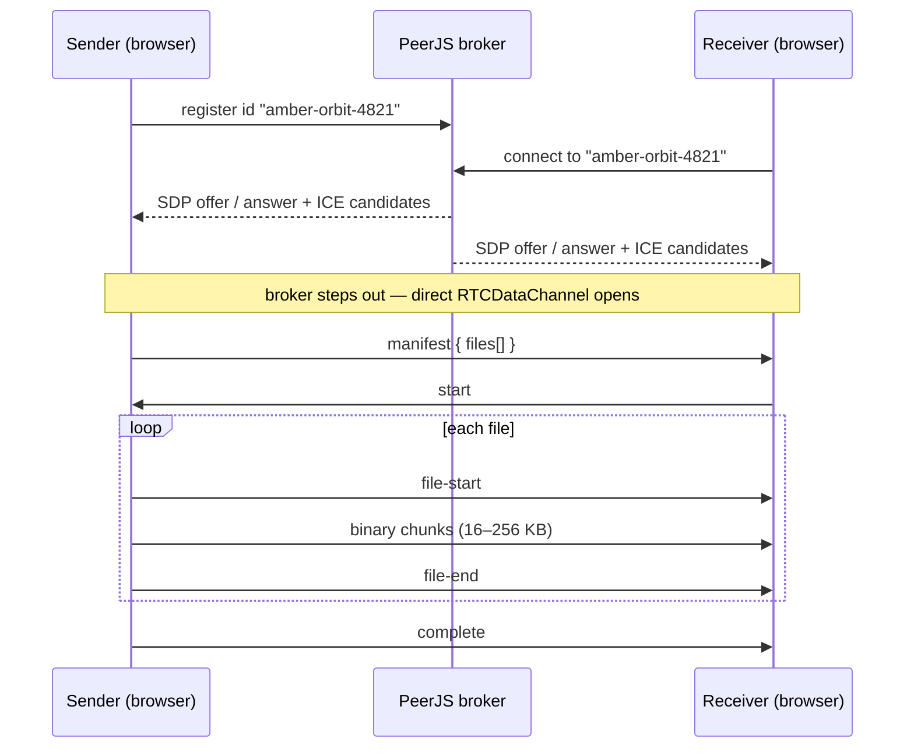

<div align="center">

# `$ drop-aj`

**Peer-to-peer photo and video transfer in the browser.**
Android ↔ iPhone, no app install, no account, no upload.

[**Live demo →**](https://drop-aj.vercel.app) &nbsp;·&nbsp; [How it works](#how-it-works) &nbsp;·&nbsp; [Run locally](#run-locally)


<!-- Replace with a GIF of a photo moving from one phone to the other -->


</div>

---

## Why

Moving photos and videos between an Android phone and an iPhone is still awkward. AirDrop is Apple-only, Quick Share is Android-only, and cloud services make you upload everything to a server and download it again.

**drop** sends files straight from one browser to the other over an encrypted WebRTC connection. Open the site, drop your files, scan the QR code on the other phone, and tap download. The files never touch a server.

## Features

- **Direct transfer.** Files travel browser to browser over a WebRTC data channel, encrypted end to end (DTLS).
- **Cross-platform.** Works in mobile Safari and Chrome. Nothing to install.
- **Photos and videos.** Multi-file selection with thumbnails, sizes and duplicate detection.
- **Large files.** The receiver writes incoming data straight to disk (Origin Private File System) through a Web Worker, so a multi-gigabyte video doesn't fill the phone's memory.
- **Tuned throughput.** Negotiated chunk size, read-ahead from disk, and flow control on the send queue.
- **Live connection log.** A terminal-style panel shows every step of the connection, including whether the route is direct or relayed and the average transfer speed.
- **Multiple receivers.** One share link can serve several downloaders at once, each with its own progress bar.
- **Mobile-aware.** Screen Wake Lock keeps the screen on during a transfer, and the log records when a tab is backgrounded.
- **Share by QR code.** Each session gets a short, human-readable link such as `/d/amber-orbit-4821`.

## How it works



**Signaling.** WebRTC needs a short handshake before two browsers can talk. Vercel's serverless functions can't hold a WebSocket open, so the handshake goes through the free PeerJS broker. After that, the broker plays no part in the transfer.

**Protocol.** The data channel runs in `raw` mode. Control messages are JSON strings and file data is `ArrayBuffer`, so the receiver tells them apart by type alone. Every message is defined as one TypeScript union in [`lib/protocol.ts`](lib/protocol.ts).

**Flow control.** `RTCDataChannel.send()` returns immediately and queues the data. The sender keeps `bufferedAmount` under a high-water mark, waits for `bufferedamountlow`, and recovers from *queue full* and *message too large* errors instead of failing.

**Disk-backed receiving.** Chunks are batched into 1 MB writes and transferred (not copied) to a dedicated worker, which writes them to OPFS with `createSyncAccessHandle()`. Safari only supports that method inside workers. If OPFS isn't available, for example in some private-browsing modes, the receiver falls back to memory and says so in the log.

## Tech stack

| Layer | Choice |
|---|---|
| Framework | Next.js 16 (App Router), React, TypeScript |
| Styling | Tailwind CSS v4, JetBrains Mono |
| P2P | WebRTC `RTCDataChannel` via PeerJS |
| Storage | Origin Private File System + Web Worker |
| Hosting | Vercel |

## Project structure

```
app/
  page.tsx                 sender: pick files, share link + QR
  d/[slug]/page.tsx        receiver: connect, download, preview
components/
  Uploader.tsx             hosting, per-peer transfer state
  Terminal.tsx             live connection log
  AsciiProgress.tsx        progress, speed, ETA
  Dropzone.tsx · FileList.tsx · Thumb.tsx · MatrixRain.tsx
lib/
  protocol.ts              message types, chunk-size negotiation
  send.ts                  chunked sender with backpressure
  sink.ts                  disk / memory receive sinks
  diagnostics.ts           ICE route detection
  useWakeLock.ts · useVisibilityLog.ts
public/
  sink-worker.js           OPFS writer (dedicated worker)
```

## Run locally

```bash
git clone https://github.com/JoshieeS/transmit.git
cd transmit
npm install
npm run dev
```

Open `http://localhost:3000` in two tabs to test a transfer.

> **Testing on phones:** iOS only allows WebRTC on secure (HTTPS) pages. Test on the deployed Vercel URL, or use an HTTPS tunnel. A plain `http://192.168.x.x` address won't work on the iPhone.

## Limitations

- **Keep both tabs open.** The sender's browser *is* the server. Locking the phone or switching apps can pause or end the transfer.
- **Different networks.** Most networks allow a direct connection. Some strict NATs (common on mobile data) don't, and those transfers need a TURN relay, which is on the roadmap. Until then, connecting one phone to the other's hotspot works.
- **iPhone Live Photos** arrive as a still image. The motion part isn't available to web pages.

## Roadmap

- [ ] TURN relay through a server-side credential route
- [ ] Save straight to the iPhone Photos app through the Web Share API
- [ ] Clear error screens and a hotspot hint for failed connections
- [ ] Optional password-protected links
- [ ] Playwright end-to-end transfer test

## Acknowledgements

The user flow was inspired by [FilePizza](https://github.com/kern/filepizza). transmit is an independent implementation with its own protocol, storage layer and interface.

## License

[MIT](LICENSE) © Joshua Silva
